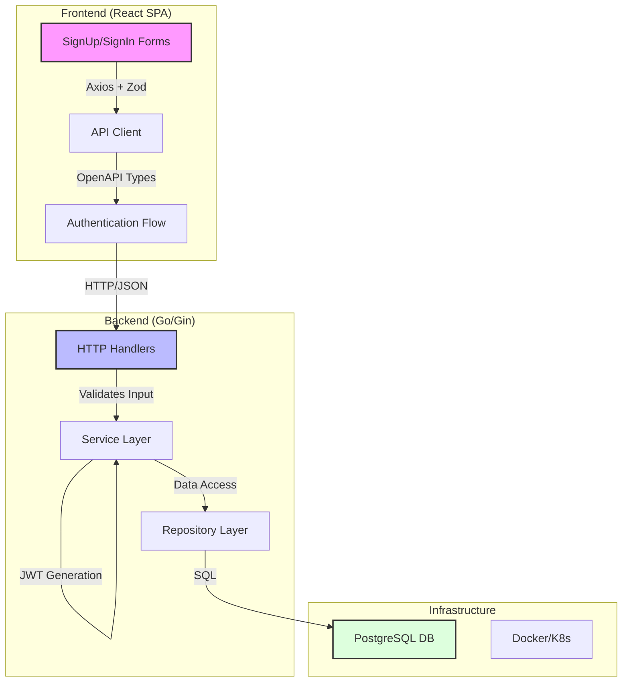

# Rakuten Symphony Full-Stack Authentication Challenge

Full-stack authentication application built with modern technologies for the Rakuten Symphony technical assessment.

## Tech Stack

**Backend:**
- Go 1.21+ (Gin framework)
- PostgreSQL 16
- JWT authentication
- Argon2id password hashing
- OpenAPI 3.0 specification

**Frontend:**
- React 18 + TypeScript
- React Hook Form + Zod validation
- React Router v6
- Axios with interceptors

**DevOps:**
- Docker + Docker Compose
- Kubernetes manifests
- Makefile automation
- GitHub Actions CI/CD

## Architecture



## Quick Start

```bash
# Clone repository
git clone https://github.com/nfsarch33/secure-auth-platform.git
cd secure-auth-platform

# Start development environment
make dev

# Access application
# Frontend: http://localhost:3000
# Backend API: http://localhost:8080
# API Docs: http://localhost:8080/swagger
```

## Assignment Requirements

Built to fulfill the following requirements:
- ✅ REST API for signup/signin/protected profile endpoint
- ✅ PostgreSQL database persistence
- ✅ React SPA with authentication flow
- ✅ Docker containerization
- ✅ Kubernetes deployment manifests
- ✅ Comprehensive documentation

## Report

See [REPORT.md](./REPORT.md) for detailed architectural decisions, security considerations, and scalability analysis.

## Author

**Jason Lian**  
Built for Rakuten Symphony Full Stack Engineer position  
November 2025

## License

MIT
